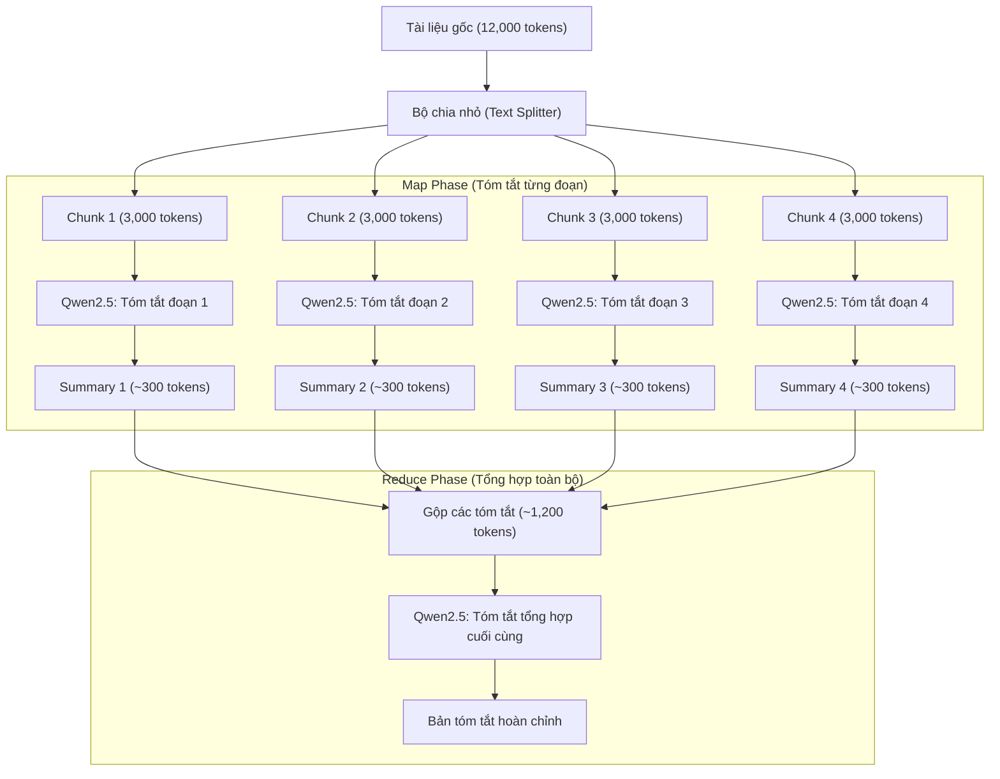

# Bài 2: Tính toán — Cơ chế Tokenization & Context Window

---

## 1. Cơ chế Tokenization & Đặc thù xử lý Tiếng Việt trên các LLM

### 1.1. Cơ chế Tokenization là gì?
- **Định nghĩa:** **Tokenization** (Phân tách từ/mã hóa) là bước tiền xử lý đầu tiên của mọi mô hình ngôn ngữ lớn (LLM). Do máy tính và mạng nơ-ron không hiểu trực tiếp văn bản dạng chuỗi (raw text), bộ tách từ (**Tokenizer**) sẽ chia văn bản thành các đơn vị nhỏ hơn gọi là **Token** (có thể là từ nguyên vẹn, từ phụ - subword, ký tự đơn lẻ hoặc chuỗi byte).
- **Mã hóa (Encoding):** Mỗi token tương ứng với một số nguyên duy nhất (**Token ID**) được tra cứu trong bảng từ vựng (**Vocabulary**) của mô hình trước khi đưa vào tầng Embedding.

### 1.2. Vì sao cùng một câu, Tiếng Việt tốn nhiều Token hơn Tiếng Anh?
Các bộ Tokenizer hiện đại của LLM (như BPE trên Llama, Qwen, GPT) thường làm cho văn bản Tiếng Việt tốn **gấp 1.5 đến 2.5 lần** lượng tokens so với Tiếng Anh cùng dung lượng từ. Nguyên nhân chính bao gồm:

1. **Sự thiên lệch trong tập dữ liệu huấn luyện Tokenizer (Training Corpus Bias):**
   - Bảng từ vựng (Vocabulary) của các Tokenizer phổ biến được huấn luyện trên tập dữ liệu đa số là Tiếng Anh (>85-90%).
   - Các từ tiếng Anh phổ biến (kể cả từ dài như `technology`, `understanding`) đều được lưu thành **1 token duy nhất**.
2. **Ký tự có dấu thanh và bảng mã UTF-8 (Diacritics & UTF-8 Encoding):**
   - Tiếng Việt sử dụng bảng chữ cái Latin mở rộng với nhiều dấu thanh và ký tự đặc biệt (`ă`, `â`, `đ`, `ê`, `ô`, `ơ`, `ư` và dấu `´`, `` ` ``, `?`, `~`, `.`).
   - Nhiều tổ hợp từ/âm tiết tiếng Việt có dấu không nằm trong Vocabulary của Tokenizer. Khi đó, Tokenizer phải phân tách từ đó thành nhiều **subwords** hoặc phân rã xuống mức **Byte-level UTF-8** (mỗi ký tự có dấu có thể bị tách thành 2-3 tokens riêng biệt).
3. **Cấu trúc từ đơn âm tiết và khoảng trắng:**
   - Tiếng Việt là ngôn ngữ đơn lập, từ ghép được tạo thành từ nhiều tiếng rời rạc cách nhau bởi dấu cách (ví dụ: `trí tuệ nhân tạo` = 4 âm tiết).
   - Tokenizer tiếng Anh thường coi mỗi âm tiết tiếng Việt kèm dấu cách là 1 token riêng biệt, trong khi khái niệm tương đương trong tiếng Anh là `AI` (1 token) hoặc `Artificial Intelligence` (2 tokens).

> **Tỷ lệ quy đổi thông thường:**
> - Tiếng Anh: `1 từ ≈ 1.3 tokens`
> - Tiếng Việt: `1 từ ≈ 1.5 - 2.0+ tokens` (8,000 từ thô tiếng Việt $\approx$ 12,000 tokens).

---

## 2. Hiện tượng tràn Context Window và hậu quả khi gửi Request

### 2.1. Hiện tượng xảy ra
- **Thông số kỹ thuật:**
  - Kích thước tài liệu + Prompt: $\approx 12,000\text{ tokens}$.
  - Giới hạn Context Window mặc định của mô hình trên Ollama: `num_ctx = 8,192 tokens`.
  - **Chênh lệch (Tràn context):** Vượt quá giới hạn $\approx 3,808\text{ tokens}$ ($\approx 32\%$ tổng nội dung).
- **Cơ chế xử lý của hệ thống:**
  - Ollama hoặc LLM Engine sẽ thực hiện **Context Truncation (Cắt xén ngữ cảnh)** để ép dữ liệu đầu vào vừa với giới hạn $8,192\text{ tokens}$. Tùy theo cấu hình xử lý, hệ thống sẽ cắt bỏ phần đầu (Head Truncation) hoặc cắt bỏ phần đuôi (Tail Truncation) của tài liệu.

### 2.2. Hậu quả đối với chất lượng tóm tắt
1. **Mất mát thông tin nghiêm trọng (Severe Information Loss):**
   - Khoảng 30% - 40% nội dung tài liệu bị bỏ qua hoàn toàn, mô hình không hề "đọc" được phần nội dung này.
2. **Ảo giác và Tóm tắt sai lệch (Hallucination / Inaccurate Summary):**
   - Do thiếu ngữ cảnh ở phần bị cắt, bản tóm tắt sẽ bị lệch ý, thiếu các luận điểm cốt lõi, bước thực hiện quan trọng hoặc kết luận kỹ thuật ở cuối tài liệu.
3. **Cạn kiệt không gian sinh Token đầu ra (Output Generation Failure):**
   - Context Window là tổng dung lượng cho cả **Input Tokens (Prompt)** + **Output Tokens (Completion)**.
   - Nếu Input chiếm trọn $8,192\text{ tokens}$, mô hình sẽ không còn đủ không gian để sinh câu trả lời, dẫn đến câu trả lời bị cụt lủn, dừng đột ngột giữa chừng hoặc trả về phản hồi rỗng.

---

## 3. Đề xuất các giải pháp kỹ thuật cụ thể

### Giải pháp 1: Kỹ thuật Chia nhỏ văn bản & Tóm tắt phân tầng (Chunking & Map-Reduce Pattern)

Đây là giải pháp kinh điển và hiệu quả nhất trong kỹ thuật xử lý văn bản dài (Long-Document Processing) mà không đòi hỏi nâng cấp phần cứng.



- **Quy trình thực hiện:**
  1. **Chunking (Chia nhỏ):** Dùng `TokenTextSplitter` chia tài liệu 12,000 tokens thành 4 đoạn nhỏ (mỗi đoạn $\approx 3,000$ tokens, kèm overlap 200 tokens để giữ ngữ cảnh liền mạch giữa các đoạn).
  2. **Map Phase:** Gửi từng đoạn vào Qwen2.5-Coder:7B để sinh ra 4 bản tóm tắt ngắn tương ứng (mỗi bản $\approx 300$ tokens).
  3. **Reduce Phase:** Ghép 4 bản tóm tắt ngắn lại thành một nội dung mới ($\approx 1,200$ tokens) và gửi một request cuối cùng đến LLM với prompt: *"Hãy tổng hợp các ý chính trên thành một tài liệu tóm tắt kỹ thuật hoàn chỉnh"*.
- **Ưu điểm:** Xử lý được tài liệu có độ dài bất kỳ, không bị giới hạn phần cứng/VRAM, các bước Map có thể chạy song song (Parallel execution) giúp tăng tốc độ.

---

### Giải pháp 2: Tăng cấu hình Context Window (`num_ctx`) trong Ollama

Mô hình gốc **Qwen2.5-Coder:7B** về mặt kiến trúc hỗ trợ Context Window gốc lên tới **32,768 tokens** (thậm chí 128k với RoPE/YaRN). Giới hạn `8,192` thực chất là thông số mặc định của Ollama để tiết kiệm bộ nhớ RAM/VRAM.

Ta có thể cấu hình mở rộng Context Window theo 2 cách:

#### Cách 2.1: Tạo Modelfile tùy chỉnh trong Ollama
Tạo một file có tên `Modelfile` với nội dung:
```dockerfile
FROM qwen2.5-coder:7b

# Mở rộng Context Window lên 32,768 tokens
PARAMETER num_ctx 32768
PARAMETER temperature 0.3
```
Sau đó build mô hình mới trong terminal:
```bash
ollama create qwen2.5-coder-32k -f ./Modelfile
```

#### Cách 2.2: Cấu hình runtime trong Spring Boot (`application-local.properties`)
Thiết lập trực tiếp thông số `num-ctx` thông qua thuộc tính của Spring AI:
```properties
spring.ai.ollama.base-url=http://localhost:11434
spring.ai.ollama.chat.options.model=qwen2.5-coder:7b
# Cấu hình Context Window trực tiếp khi gọi API
spring.ai.ollama.chat.options.num-ctx=32768
```

- **Ưu điểm:** Mô hình đọc toàn bộ tài liệu trong 1 lượt (Single pass), nắm bắt được mối quan hệ logic xuyên suốt toàn bài mà không cần chia nhỏ.
- **Lưu ý phần cứng (VRAM/RAM):** Tăng `num_ctx` từ 8k lên 32k sẽ làm tăng dung lượng KV Cache tiêu tốn thêm khoảng **2GB - 4GB VRAM GPU** (hoặc RAM hệ thống nếu chạy CPU). Cần đảm bảo máy tính chạy local có đủ tài nguyên.

---

## 4. Bảng so sánh 2 giải pháp

| Tiêu chí | Giải pháp 1: Chunking & Map-Reduce | Giải pháp 2: Tăng `num_ctx` (32k) |
| :--- | :---: | :---: |
| **Độ dài tài liệu tối đa** | Không giới hạn (100k+ tokens vẫn xử lý được) | Giới hạn bởi 32k tokens |
| **Yêu cầu phần cứng (RAM/VRAM)** | **Thấp** (Chỉ cần chạy ở mức 4k - 8k context) | **Cao hơn** (Tốn thêm 2-4GB VRAM cho KV Cache) |
| **Số lượt gọi LLM** | Nhiều lượt (4 Map requests + 1 Reduce request) | **Duy nhất 1 lượt (1 request)** |
| **Tính liên kết ngữ cảnh toàn cục** | Trung bình (cần viết prompt Reduce tốt) | **Tốt nhất** (Mô hình nhìn thấy toàn bộ dữ liệu) |
