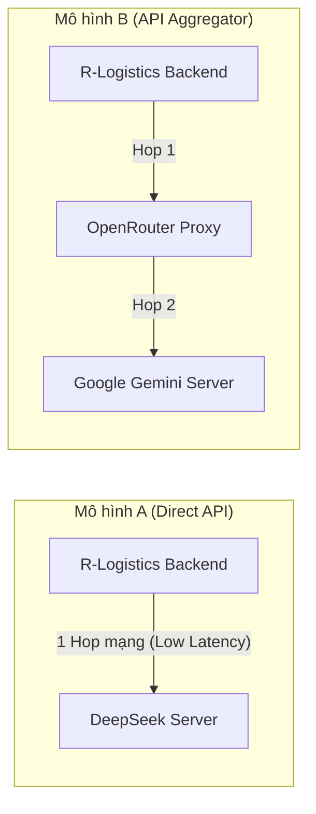

# Bài 3: Phân tích Tài chính — Tính toán chi phí AI

---

## 1. Tính toán chi phí cơ sở (Mô hình A vs Mô hình B)

### 1.1. Thông số tiêu thụ Token cơ sở
- **Số lượng hóa đơn xử lý:** $10,000\text{ hóa đơn/ngày}$.
- **Token Input / hóa đơn:** $1,500\text{ tokens}$.
- **Token Output / hóa đơn:** $500\text{ tokens}$.

**Tổng lượng Token hàng ngày & hàng tháng (30 ngày):**
- **Token Input:**
  - Hàng ngày: $10,000 \times 1,500 = 15,000,000\text{ tokens} = \mathbf{15\text{ M tokens/ngày}}$.
  - Hàng tháng (30 ngày): $15\text{M} \times 30 = \mathbf{450\text{ M tokens/tháng}}$.
- **Token Output:**
  - Hàng ngày: $10,000 \times 500 = 5,000,000\text{ tokens} = \mathbf{5\text{ M tokens/ngày}}$.
  - Hàng tháng (30 ngày): $5\text{M} \times 30 = \mathbf{150\text{ M tokens/tháng}}$.

---

### 1.2. Chi phí Mô hình A (Direct API - DeepSeek Chat)
- Đơn giá: **Input: $0.14 / 1M tokens** | **Output: $0.28 / 1M tokens**

$$\text{Chi phí Input/ngày} = 15\text{M} \times \$0.14 = \$2.10$$

$$\text{Chi phí Output/ngày} = 5\text{M} \times \$0.28 = \$1.40$$

- **Tổng chi phí hàng ngày (Mô hình A):**
  $$\text{Tổng/ngày} = \$2.10 + \$1.40 = \mathbf{\$3.50/\text{ngày}}$$
- **Tổng chi phí hàng tháng (30 ngày):**
  $$\text{Tổng/tháng} = \$3.50 \times 30 = \mathbf{\$105.00/\text{tháng}}$$

---

### 1.3. Chi phí Mô hình B (API Aggregator - OpenRouter gọi Gemini 2.5 Flash)
- Đơn giá: **Input: $0.075 / 1M tokens** | **Output: $0.30 / 1M tokens**

$$\text{Chi phí Input/ngày} = 15\text{M} \times \$0.075 = \$1.125$$

$$\text{Chi phí Output/ngày} = 5\text{M} \times \$0.30 = \$1.500$$

- **Tổng chi phí hàng ngày (Mô hình B lý tưởng):**
  $$\text{Tổng/ngày} = \$1.125 + \$1.500 = \mathbf{\$2.625/\text{ngày}}$$
- **Tổng chi phí hàng tháng (30 ngày):**
  $$\text{Tổng/tháng} = \$2.625 \times 30 = \mathbf{\$78.75/\text{tháng}}$$

---

## 2. Tính toán chi phí điều chỉnh (Có tính Retry & Tỉ lệ lỗi của Mô hình B)

### 2.1. Đánh giá tác động của Retry
- Tỉ lệ lỗi/mất kết nối: $0.5\%$.
- Lượng token đầu vào phát sinh thêm do retry: **$+5\%$ tổng số token Input hàng ngày**.

$$\text{Token Input thực tế/ngày} = 15\text{M} \times (1 + 0.05) = 15\text{M} \times 1.05 = \mathbf{15.75\text{ M tokens/ngày}}$$

$$\text{Token Input thực tế/tháng} = 15.75\text{M} \times 30 = \mathbf{472.5\text{ M tokens/tháng}}$$

*(Lượng Token Output thành công không đổi: $5\text{M tokens/ngày}$)*.

### 2.2. Chi phí thực tế điều chỉnh của Mô hình B
- **Chi phí Input thực tế/ngày:**
  $$\text{Chi phí Input} = 15.75\text{M} \times \$0.075 = \$1.18125/\text{ngày}$$
- **Chi phí Output thực tế/ngày:**
  $$\text{Chi phí Output} = 5\text{M} \times \$0.30 = \$1.50000/\text{ngày}$$
- **Tổng chi phí hàng ngày (Sau điều chỉnh):**
  $$\text{Tổng/ngày} = \$1.18125 + \$1.50000 = \mathbf{\$2.68125/\text{ngày}}$$
- **Tổng chi phí hàng tháng (Sau điều chỉnh - 30 ngày):**
  $$\text{Tổng/tháng} = \$2.68125 \times 30 = \mathbf{\$80.4375/\text{tháng}} \approx \mathbf{\$80.44/\text{tháng}}$$

> **Nhận xét tài chính:**  
> Sau khi bù đắp $5\%$ chi phí retry, Mô hình B chỉ tăng thêm **$\$1.6875/\text{tháng}$** (từ $\$78.75 \rightarrow \$80.44$).  
> So với Mô hình A ($\$105.00/\text{tháng}$), Mô hình B vẫn **tiết kiệm hơn $\$24.56/\text{tháng}$** ($\approx 23.4\%$).

---

## 3. Phân tích yếu tố phi tài chính & Quyết định Kiến trúc sư Giải pháp

Bên cạnh bài toán số học, để đưa ra quyết định dài hạn cho hệ thống phân tích hóa đơn R-Logistics, cần đánh giá các yếu tố kỹ thuật sau:

### 3.1. Phân tích các tiêu chí phi tài chính

| Tiêu chí | Mô hình A: Direct API (DeepSeek) | Mô hình B: Aggregator (OpenRouter + Gemini) |
| :--- | :--- | :--- |
| **1. Độ trễ (Latency)** | **Thấp & Ổn định:** Kết nối trực tiếp máy chủ cung cấp (1 hop). | **Cao hơn:** Bị cộng thêm $50-200\text{ms}$ do đi qua proxy trung gian của OpenRouter. |
| **2. Độ sẵn sàng & SLA** | Phụ thuộc vào hạ tầng duy nhất của DeepSeek. Nếu DeepSeek nghẽn hoặc quá tải, toàn bộ hệ thống bị ảnh hưởng. | **Có tính linh hoạt cao:** OpenRouter có cơ chế load balancing, auto-fallback sang model dự phòng nếu upstream provider bị down. Tuy nhiên OpenRouter lại là điểm lỗi đơn lẻ (Single Point of Failure). |
| **3. Vendor Lock-in & Tính linh hoạt** | Nếu DeepSeek đổi cấu trúc API hoặc chính sách giá, việc chuyển đổi đòi hỏi can thiệp code/cấu hình. | **Không bị Lock-in:** OpenRouter chuẩn hóa toàn bộ request theo chuẩn OpenAI API, cho phép đổi giữa 100+ mô hình chỉ bằng cách sửa tham số `model`. |
| **4. Bảo mật dữ liệu & Tuân thủ (Compliance)** | **Tốt hơn:** Dữ liệu hóa đơn logistics (thông tin doanh nghiệp, giá trị tiền, MST) chỉ đi qua 1 đối tác xử lý. | **Rủi ro cao hơn:** Dữ liệu đi qua bên thứ 3 (OpenRouter) rồi mới sang bên thứ 4 (Google), tiềm ẩn rủi ro về rò rỉ dữ liệu hoặc khó khăn khi kiểm toán bảo mật (SOC2, ISO, GDPR). |
| **5. Giới hạn tốc độ (Rate Limits)** | Phụ thuộc vào Tier tài khoản trực tiếp với DeepSeek. | Được gom chung trong quota của OpenRouter, có thể bị chia sẻ băng thông với các khách hàng khác. |

---

### 3.2. Đề xuất quyết định & Chiến lược Kiến trúc dài hạn

Đối với hệ thống **xử lý 10,000 hóa đơn/ngày** của doanh nghiệp Logistics:

1. **Khuyến nghị Lựa chọn:**
   - **Giai đoạn 1 (Hiện tại - Pilot/Tăng tốc phát triển):** Chọn **Mô hình B (OpenRouter + Gemini 2.5 Flash)**.
     - *Lý do:* Tiết kiệm chi phí $\approx 23.4\%$, Gemini 2.5 Flash có khả năng đọc hiểu và trích xuất cấu trúc JSON từ tài liệu cực kỳ chính xác, chuẩn OpenAI API giúp team dev triển khai nhanh mà không bị ràng buộc hạ tầng.
2. **Chiến lược Kiến trúc dài hạn (Production Scale-up):**
   - **Xây dựng AI Gateway nội bộ (Internal Gateway Pattern) trên Spring AI:**
     - Thay vì phụ thuộc vào OpenRouter bên thứ ba, doanh nghiệp nên sử dụng tính năng Client linh hoạt của **Spring AI** để gọi **Direct API đến Google Gemini (hoặc DeepSeek)**.
     - Tự cấu hình **Circuit Breaker / Retry Policy (Resilience4j)** trên backend Spring Boot:
       - Luồng chính: Gọi Direct Gemini 2.5 Flash để đạt giá rẻ nhất, bảo mật dữ liệu tuyệt đối và độ trễ thấp nhất.
       - Luồng dự phòng (Fallback): Tự động chuyển hướng sang DeepSeek / Claude nếu Google gặp sự cố.
     - Cách làm này giúp doanh nghiệp hưởng trọn vẹn: **Chi phí tối ưu nhất + Độ trễ thấp nhất + Bảo mật dữ liệu nội bộ + Triệt tiêu nguy cơ Single Point of Failure từ bên trung gian**.
